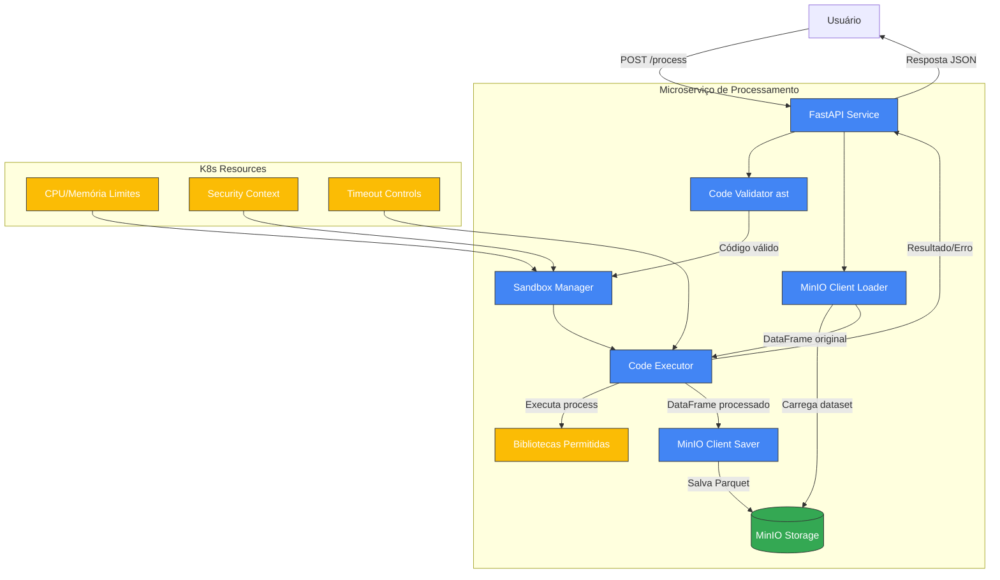

```mermaid
flowchart TB
    User[Usuário] -->|"POST /process"| API[FastAPI Service]
    
    subgraph "Microserviço de Processamento"
    API --> Validator[Code Validator ast]
    API --> MinIOLoad[MinIO Client Loader]
    
    MinIOLoad -->|"Carrega dataset"| Minio[(MinIO Storage)]
    
    Validator -->|"Código válido"| Sandbox[Sandbox Manager]
    Sandbox --> Executor[Code Executor]
    
    MinIOLoad -->|"DataFrame original"| Executor
    Executor -->|"Executa process"| Libraries[Bibliotecas Permitidas]
    
    Executor -->|"DataFrame processado"| MinIOSave[MinIO Client Saver]
    MinIOSave -->|"Salva Parquet"| Minio
    
    Executor -->|"Resultado/Erro"| API
    end
    
    API -->|"Resposta JSON"| User
    
    subgraph "K8s Resources"
    Resources[CPU/Memória Limites]
    Security[Security Context]
    Timeout[Timeout Controls]
    end
    
    Resources --> Sandbox
    Security --> Sandbox
    Timeout --> Executor
    
    classDef primary fill:#4285F4,stroke:#333,stroke-width:1px,color:white
    classDef secondary fill:#34A853,stroke:#333,stroke-width:1px,color:white
    classDef accent fill:#FBBC05,stroke:#333,stroke-width:1px,color:white
    
    class API,Validator,MinIOLoad,MinIOSave,Executor,Sandbox primary
    class Minio secondary
    class Libraries,Resources,Security,Timeout accent
```