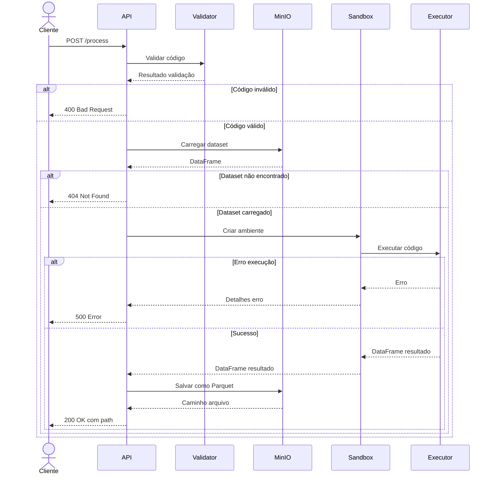

```mermaid
sequenceDiagram
    actor User as Cliente
    participant API as API
    participant Validator as Validator
    participant MinIO as MinIO
    participant Sandbox as Sandbox
    participant Executor as Executor
    
    User->>API: POST /process
    API->>Validator: Validar código
    Validator-->>API: Resultado validação
    
    alt Código inválido
        API-->>User: 400 Bad Request
    else Código válido
        API->>MinIO: Carregar dataset
        MinIO-->>API: DataFrame
        
        alt Dataset não encontrado
            API-->>User: 404 Not Found
        else Dataset carregado
            API->>Sandbox: Criar ambiente
            Sandbox->>Executor: Executar código
            
            alt Erro execução
                Executor-->>Sandbox: Erro
                Sandbox-->>API: Detalhes erro
                API-->>User: 500 Error
            else Sucesso
                Executor-->>Sandbox: DataFrame resultado
                Sandbox-->>API: DataFrame resultado
                API->>MinIO: Salvar como Parquet
                MinIO-->>API: Caminho arquivo
                API-->>User: 200 OK com path
            end
        end
    end
```