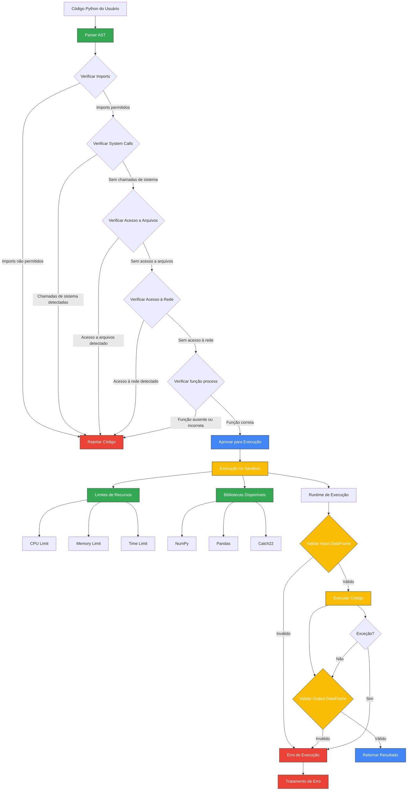

```mermaid
flowchart TB
    CodeInput[Código Python do Usuário] --> ASTParser[Parser AST]
    
    ASTParser --> ImportChecker{Verificar Imports}
    ImportChecker -->|"Imports permitidos"| SysCallCheck{Verificar System Calls}
    ImportChecker -->|"Imports não permitidos"| Reject[Rejeitar Código]
    
    SysCallCheck -->|"Sem chamadas de sistema"| FileAccessCheck{Verificar Acesso a Arquivos}
    SysCallCheck -->|"Chamadas de sistema detectadas"| Reject
    
    FileAccessCheck -->|"Sem acesso a arquivos"| NetworkCheck{Verificar Acesso à Rede}
    FileAccessCheck -->|"Acesso a arquivos detectado"| Reject
    
    NetworkCheck -->|"Sem acesso à rede"| FunctionCheck{Verificar função process}
    NetworkCheck -->|"Acesso à rede detectado"| Reject
    
    FunctionCheck -->|"Função correta"| Approve[Aprovar para Execução]
    FunctionCheck -->|"Função ausente ou incorreta"| Reject
    
    Approve --> Sandbox[Execução no Sandbox]
    
    Sandbox --> ResourceLimits[Limites de Recursos]
    ResourceLimits --> CPULimit[CPU Limit]
    ResourceLimits --> MemoryLimit[Memory Limit]
    ResourceLimits --> TimeLimit[Time Limit]
    
    Sandbox --> Libraries[Bibliotecas Disponíveis]
    Libraries --> Numpy[NumPy]
    Libraries --> Pandas[Pandas]
    Libraries --> Catch22[Catch22]
    
    Sandbox --> Runtime[Runtime de Execução]
    Runtime --> InputValid{Validar Input DataFrame}
    InputValid -->|"Válido"| ExecuteCode[Executar Código]
    InputValid -->|"Inválido"| RuntimeError[Erro de Execução]
    
    ExecuteCode --> OutputValid{Validar Output DataFrame}
    OutputValid -->|"Válido"| Success[Retornar Resultado]
    OutputValid -->|"Inválido"| RuntimeError
    
    ExecuteCode --> Exception{Exceção?}
    Exception -->|"Sim"| RuntimeError
    Exception -->|"Não"| OutputValid
    
    RuntimeError --> ErrorHandling[Tratamento de Erro]
    
    classDef primary fill:#4285F4,stroke:#333,stroke-width:1px,color:white
    classDef negative fill:#EA4335,stroke:#333,stroke-width:1px,color:white
    classDef security fill:#34A853,stroke:#333,stroke-width:1px,color:white
    classDef execution fill:#FBBC05,stroke:#333,stroke-width:1px,color:white
    
    class Approve,Success primary
    class Reject,RuntimeError,ErrorHandling negative
    class ResourceLimits,Libraries,ASTParser security
    class Sandbox,ExecuteCode,InputValid,OutputValid execution
```